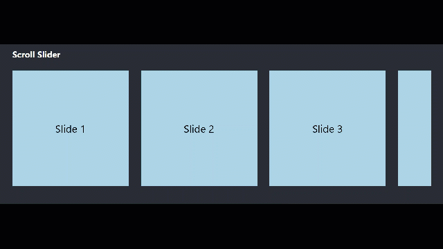

# Slider Component

The `react-infinite-slider-carousel` is a React component for creating advanced, customizable sliders with support for infinite sliding, autoplay, responsive sizing, and smooth animations. The slider operates in two Scrollable and Advanced modes.


|Version     | Compatibility|
|------------|--------------|
|0.x         | React 18.2+ |


It also use below libraries as dependencies:
```json
    "classnames": "^2.3.2", 
    "emittery": "^1.0.1",
    "lodash": "^4.17.21",
    "mobx": "^6.6.2",
    "mobx-react-lite": "^3.4.0"
 ```

#### Technical Documentation

- [Installing](#installing)
- [Exports](#exports)
- [Usage](#usage)
- [Scripts](#scripts)


### Installing

```bash
$ npm install react-infinite-slider-carousel
```
------

### Exports

The component export is `<Slider>`.
Here's how to use it:

```js
// ES6
import { Slider } from 'react-infinite-slider-carousel'; // <Slider component>
```
------

### Usage

#### Advanced Slider with Config Passing:


```tsx
 <Slider config={ config } >
     { children }
 </Slider>
```
```ts
interface SliderConfig {
  // Behavior
  infinite?: boolean; // Enable infinite sliding (default: false)
  autoPlay?: boolean; // Enable autoplay mode (default: false)
  autoPlayInterval?: number;  // Time autoPlayInterval for autoplay in ms (default: 5000)
  rtl?: boolean;      // Right-to-left sliding direction (default: false)

  // Appearance
  centerMode?: boolean;        // Center active slide (default: false)
  scaleUpOnActive?: boolean;   // Scale up the active slide (default: false)
  visibleSlidesCount?: number;  // Number of slides visible at a time
  sliderWidth?: number; // Set specific width for the slider container
  gapBetweenSlides?: number;   // Gap between slides in pixels (default: 0)
  offset?: number;           // Gap before/after first/last slide in pixels
  slideWidth?: number;       // Fixed width for each slide
  slideClassName?: string; //Optional CSS class name to apply to each slider item.

  // Animation
  animationDuration?: number;  // Slide transition duration in ms (default: 400)
  minimumSwipeDistance?: number;          // Minimum threshold to trigger slide (default: 50)
  slidesToMove?: number;        // Number of slides to move in one transition (default: 1)
}
```

#### Scrollable slider for Simple usage:


```tsx
  <Slider useScroll={true}>
     { children }
  </Slider>
```

```ts
  children: Array<ReactElement>
```

#### Add extra css classes:

```tsx
 <Slider 
     sliderClassName={rootClassName} 
     sliderWrapperClassName={listClassName}
     config={ config }
 >
     { children }
 </Slider>
```

```ts
 - sliderClassName?: string
 - sliderWrapperClassName?: string
```

## Infinite Slider

- set ```infinite=true``` to have infinity.
- If you need the center mode set ```centerMode=true```.
- To scale up of the active slide you should use ```scaleUpOnActive=true```.

```tsx
 <Slider
      config={ {
        infinite: true,
        centerMode: true,
        scaleUpOnActive: true,
      } }
  >
     { children }
 </Slider>
```

## Auto play

- Use ```autoPlay=true``` to move automatically on each 5000ms.
- If you need the change the autoPlayInterval time set ```autoPlayInterval=YOUR_INTERVAL_NUM```. The unit is millisecond and it recommended to be bigger than 1000ms.
- To change the moving direction on autoPlayInterval you should set ```rtl=true```.

```tsx
 <Slider
      config={ {
        autoPlay: true,
        autoPlayInterval: 15000,
        rtl: true,
      } }
  >
     { children }
 </Slider>
```

## Sliding effect

- The default animation duration of the changing slide is 400ms, which you can change it by ```animationDuration=YOUR_INTERVAL_NUM```. The unit is millisecond and it recommended to be less than 1000ms.

- There is a 50px default threshold to prevent small touchs to changing slide, which you can change it by ```minimumSwipeDistance=YOUR_THRESHOLD```. The unit is px and it recommended to be bigger than 30px.

- The default count of slide changing is 1, which you can change it by ```slidesToMove=YOUR_COUNT```.

```tsx
 <Slider
      config={ {
        animationDuration: 400,
        minimumSwipeDistance: 100,
        slidesToMove: 2,
      } }
  >
     { children }
 </Slider>
```


## Sizing
There are 3 ways to render slides:
- 1. Don't define any config and allow the Slider to use children size and styles.

- 2. Set ```visibleSlidesCount``` , ```gap```, and ```offset``` to compute the width of children by it's parrent and show count value.

- 3. Set specific ```width```, ```gap```, and ```offset```.

- ```gapBetweenSlides``` is the gap between slides.
- ```offset``` is the first and last gap of items.

```tsx
 <Slider
      config={ {
        visibleSlidesCount: 1,
        offset: 40 ,
        gapBetweenSlides: 20,
      } }
  >
     { children }
 </Slider>
```

## Full config sample

```tsx
 <Slider
      config={ {
        autoPlay: true,
        autoPlayInterval: 15000,
        rtl: false,
        infinite: true,
        centerMode: true,
        scaleUpOnActive: true,
        animationDuration: 500,
        minimumSwipeDistance: 100,
        slidesToMove: 1,
        visibleSlidesCount: 3,
        offset: 40,
        gapBetweenSlides: 20,
        slideClassName: 'slide'
      } }
  >
     { children }
 </Slider>
```

------


### Scripts

In the project directory, you can run:

### `npm test`

Launches the test runner in the interactive watch mode.\
See the section about [running tests](https://facebook.github.io/create-react-app/docs/running-tests) for more information.

### `npm run publish`

Change the version of package in the package.json and the run the command to build and publish the new version of the library.

### `npm run build`

Builds the app to see the publish files on the `dist` folder.

Your app is ready to be deployed!

------

### License

MIT
